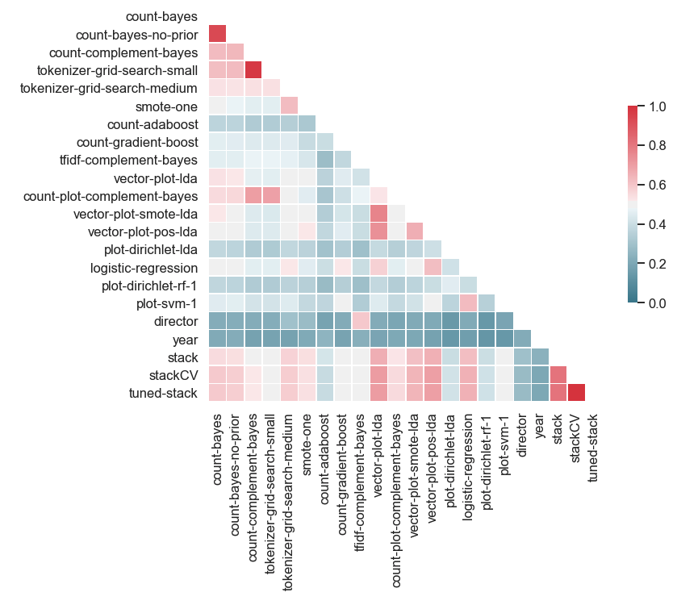
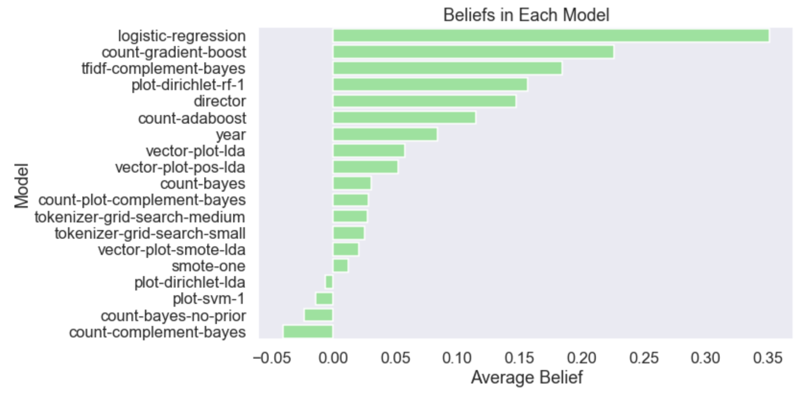
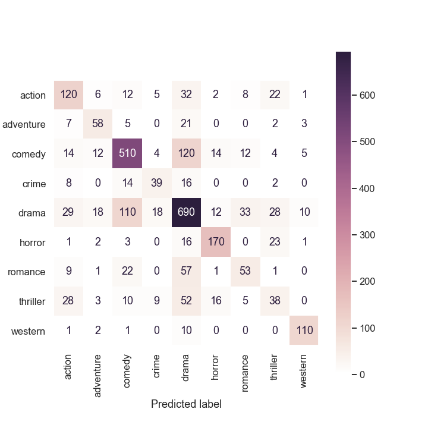
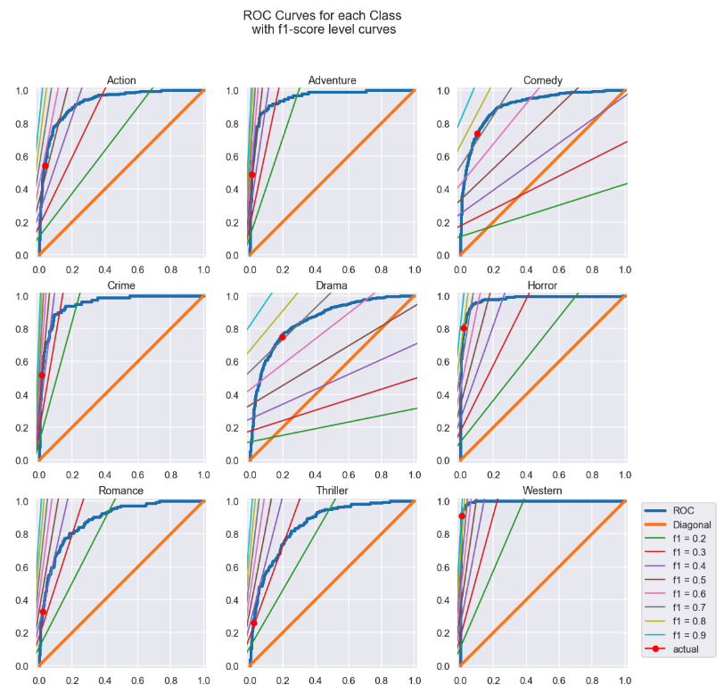

# Movie Genre Classification
This is my submission for a "bakeoff" for our Flatiron School Data Science program.

## Data
__Train__: Approximately 10,000 movies with their genre, title, year, director, cast (possibly missing)
and a plot description.

__Test__: Approximately 3,500 movies with the same information but possibly without a genre

The test set was held out by our instructor and was evaluated separately. The
relevant metric was class-weighted F1 score.

## Task
9-class classification, primarily with NLP techniques.

## Approach
I tried some combinations of a variety of strategies:
1. **Pre-process** Grid Search for the Parts of Speech
2. **Embedding** Count Vectorization, TF-IDF vectorization, a word embedding
(pre-computed by the spaCy package), or Latent Dirichlet Allocation
3. (optional) SMOTE
4. **Classify** primarily Bernoulli/Multinomial Naive Bayes, Complement Naive Bayes, Logistic Regression,
and Linear Discriminant Analysis (LDA).

A smattering of other classifiers (Support-Vector Classifier, AdaBoost, Random Forest, Gradient-boosted trees) were also tried. An LSTM (Long short-term memory recurrent neural network) was also fit (results not shown) for practice, but the results were not promising.

Hyper-parameter searches of varying degrees of comprehensiveness were performed.

Finally, a stacked classifier was fit with Logistic Regression as the final estimator.
I also tried grid-search on the logistic regression and tuning the thresholds on this stacked
classifier without much change in results.

## Results
Most decent models were clustered in a range of F1 scores from 50–60% on a held-out validation set. The
stacked classifier was able to accomplish about 66%. The simplest stacked classifier (number 20) was chosen
because it was comparable in performance to the other variations on it and is the simplest.

The stacked model includes all 19 of the lower numbered models. Probabilistic outputs from the base models were
fed into a trimmed logit transformer before going into a vanilla logistic regression.

Note: fit times are reported in seconds of wall time, on a 2.7 GHz Intel Core i5 (dual core). They are not directly comparable since grid searches of different sizes were performed (or no grid search at all).

Abbreviations
- POS: parts-of-speech
- LDA: Linear Discriminant Analysis
- TF-IDF: term-frequency inverse document-frequency
- NB: Naive Bayes
- SVC: Support Vector Classifier (no SVM was attempted)
- SMOTE: Synthetic Minority Oversampling Technique

<table border="1" class="dataframe">  <thead>    <tr style="text-align: right;">      <th>Number</th><th>Model</th>      <th>Precision</th>      <th>Accuracy</th>      <th>Recall</th>      <th>F1</th>      <th>Cross-Entropy (Train)</th>      <th>Cross-Entropy (Test)</th>      <th>Fit Time</th>    </tr></thead>  <tbody>    <tr>      <th>22</th>      <td>Stack -&gt; Tuned Thresholds</td>      <td>0.66</td>      <td>0.67</td>      <td>0.67</td>      <td>0.66</td>      <td>0.36</td>      <td>0.93</td>      <td>1211.32</td>    </tr>    <tr>      <th>21</th>      <td>Stack -&gt; Grid Search Logistic</td>      <td>0.66</td>      <td>0.67</td>      <td>0.67</td>      <td>0.66</td>      <td>0.36</td>      <td>0.93</td>      <td>12128.41</td>    </tr>    <tr>      <th>20</th>      <td>Stack -&gt; Logistic</td>      <td>0.66</td>      <td>0.67</td>      <td>0.67</td>      <td>0.67</td>      <td>0.33</td>      <td>0.94</td>      <td>2749.24</td>    </tr>    <tr>      <th>15</th>      <td>Variable Vectorizer, POS plot -&gt; Logistic</td>      <td>0.62</td>      <td>0.62</td>      <td>0.62</td>      <td>0.60</td>      <td>0.83</td>      <td>1.12</td>      <td>988.97</td>    </tr>    <tr>      <th>8</th>      <td>Count Vectorizer -&gt; GradientBoosting</td>      <td>0.56</td>      <td>0.55</td>      <td>0.55</td>      <td>0.52</td>      <td>0.85</td>      <td>1.28</td>      <td>156.57</td>    </tr>    <tr>      <th>10</th>      <td>Word-Embed Plot -&gt; LDA</td>      <td>0.60</td>      <td>0.60</td>      <td>0.60</td>      <td>0.60</td>      <td>1.05</td>      <td>1.29</td>      <td>27.59</td>    </tr>    <tr>      <th>13</th>      <td>Word Embed limited POS plot -&gt; LDA</td>      <td>0.60</td>      <td>0.61</td>      <td>0.61</td>      <td>0.60</td>      <td>1.08</td>      <td>1.34</td>      <td>2879.78</td>    </tr>    <tr>      <th>14</th>      <td>Latent Dirichlet Plot -&gt; LDA</td>      <td>0.45</td>      <td>0.45</td>      <td>0.45</td>      <td>0.42</td>      <td>1.36</td>      <td>1.35</td>      <td>18758.21</td>    </tr>    <tr>      <th>9</th>      <td>TF-IDF -&gt; Complement NB</td>      <td>0.54</td>      <td>0.56</td>      <td>0.56</td>      <td>0.54</td>      <td>0.84</td>      <td>1.64</td>      <td>55.18</td>    </tr>    <tr>      <th>18</th>      <td>Director -&gt; Bernoulli NB</td>      <td>0.42</td>      <td>0.44</td>      <td>0.44</td>      <td>0.41</td>      <td>0.93</td>      <td>1.67</td>      <td>20.82</td>    </tr>    <tr>      <th>12</th>      <td>Word-embed plot -&gt; SMOTE -&gt; LDA</td>      <td>0.60</td>      <td>0.53</td>      <td>0.53</td>      <td>0.54</td>      <td>1.53</td>      <td>1.90</td>      <td>1484.18</td>    </tr>    <tr>      <th>16</th>      <td>Latent Dirichlet plot -&gt; Random Forest</td>      <td>0.43</td>      <td>0.45</td>      <td>0.45</td>      <td>0.43</td>      <td>0.29</td>      <td>1.93</td>      <td>84.99</td>    </tr>    <tr>      <th>5</th>      <td>POS grid-search med -&gt; Complement NB</td>      <td>0.57</td>      <td>0.59</td>      <td>0.59</td>      <td>0.56</td>      <td>0.55</td>      <td>1.97</td>      <td>6503.43</td>    </tr>    <tr>      <th>7</th>      <td>Count Vectorizer, Plot, Year -&gt; AdaBoost(Tree)</td>      <td>0.45</td>      <td>0.44</td>      <td>0.44</td>      <td>0.41</td>      <td>2.02</td>      <td>2.04</td>      <td>570.44</td>    </tr>    <tr>      <th>19</th>      <td>Year -&gt; Complement NB</td>      <td>0.24</td>      <td>0.19</td>      <td>0.19</td>      <td>0.18</td>      <td>2.18</td>      <td>2.18</td>      <td>9.59</td>    </tr>    <tr>      <th>6</th>      <td>Limited parts-of-speech -&gt; SMOTE -&gt; Complement NB</td>      <td>0.57</td>      <td>0.49</td>      <td>0.49</td>      <td>0.49</td>      <td>0.73</td>      <td>2.47</td>      <td>11464.26</td>    </tr>    <tr>      <th>11</th>      <td>Count Vectorizer plot -&gt; Complement NB</td>      <td>0.55</td>      <td>0.56</td>      <td>0.56</td>      <td>0.55</td>      <td>0.57</td>      <td>3.46</td>      <td>53.39</td>    </tr>    <tr>      <th>3</th>      <td>Count-Vectorize -&gt; Complement NB</td>      <td>0.52</td>      <td>0.54</td>      <td>0.54</td>      <td>0.51</td>      <td>0.73</td>      <td>4.67</td>      <td>75.65</td>    </tr>    <tr>      <th>4</th>      <td>POS grid-search -&gt; Complement NB</td>      <td>0.52</td>      <td>0.54</td>      <td>0.54</td>      <td>0.51</td>      <td>0.67</td>      <td>4.77</td>      <td>184.41</td>    </tr>    <tr>      <th>1</th>      <td>Count-Vectorize -&gt; Multinomial NB</td>      <td>0.56</td>      <td>0.53</td>      <td>0.53</td>      <td>0.53</td>      <td>4.02</td>      <td>10.31</td>      <td>53.33</td>    </tr>    <tr>      <th>2</th>      <td>Count-Vectorize -&gt; Multinomial NB no prior</td>      <td>0.55</td>      <td>0.53</td>      <td>0.53</td>      <td>0.53</td>      <td>4.21</td>      <td>10.40</td>      <td>49.93</td>    </tr>    <tr>      <th>17</th>      <td>Count Vectorizer -&gt; SVC</td>      <td>0.58</td>      <td>0.56</td>      <td>0.56</td>      <td>0.51</td>      <td>NaN</td>      <td>NaN</td>      <td>86.97</td>    </tr>  </tbody></table>

### Base Models
The base models were fit in an attempt to achieve better performance but clear bounds were reached. To understand why the stack works so well, we can start with noting that the models give different answers through the below correlation matrix. The correlation matrix is the Cramer's V score for the cross-tabulation of each pair of model's predictions.

We can see also the importance placed by the stacked classifier on each model. For each model, I calculate the "belief" which is a term I made up. For each class, the logistic regression assigned a coefficient to the confidence (evidence) that the model assigns to that class. So if Model 1 predicts class 2 with 3 nats of evidence and the logistic regression assigns a coefficient of 2, then the stacked classifier counts 6 nats of evidence from the first model. Then the evidence for each class is added up and the class with the most evidence is predicted. For more on evidence, see [here](https://towardsdatascience.com/understanding-logistic-regression-coefficients-7a719ebebd35).

### Classification Report

<table border="1" class="dataframe">  <thead>    <tr style="text-align: right;">      <th></th>      <th>action</th>      <th>adventure</th>      <th>comedy</th>      <th>crime</th>      <th>drama</th>      <th>horror</th>      <th>romance</th>      <th>thriller</th>      <th>western</th>      <th>accuracy</th>      <th>macro avg</th>      <th>weighted avg</th>    </tr>  </thead>  <tbody>    <tr>      <th>precision</th>      <td>0.555046</td>      <td>0.568627</td>      <td>0.742733</td>      <td>0.520000</td>      <td>0.684418</td>      <td>0.790698</td>      <td>0.477477</td>      <td>0.316667</td>      <td>0.843750</td>      <td>0.67091</td>      <td>0.611046</td>      <td>0.662927</td>    </tr>    <tr>      <th>recall</th>      <td>0.578947</td>      <td>0.604167</td>      <td>0.738439</td>      <td>0.493671</td>      <td>0.728992</td>      <td>0.787037</td>      <td>0.368056</td>      <td>0.236025</td>      <td>0.885246</td>      <td>0.67091</td>      <td>0.602287</td>      <td>0.670910</td>    </tr>    <tr>      <th>f1-score</th>      <td>0.566745</td>      <td>0.585859</td>      <td>0.740580</td>      <td>0.506494</td>      <td>0.706002</td>      <td>0.788863</td>      <td>0.415686</td>      <td>0.270463</td>      <td>0.864000</td>      <td>0.67091</td>      <td>0.604966</td>      <td>0.665858</td>    </tr>    <tr>      <th>support</th>      <td>209.000000</td>      <td>96.000000</td>      <td>692.000000</td>      <td>79.000000</td>      <td>952.000000</td>      <td>216.000000</td>      <td>144.000000</td>      <td>161.000000</td>      <td>122.000000</td>      <td>0.67091</td>      <td>2671.000000</td>      <td>2671.000000</td>    </tr>  </tbody></table>

### Classification Report: ROC Curves
ROC curves for the final model are shown below. They should be interpreted with caution since thresholds for each of the classes cannot be adjusted independently. The blue curve shows the ROC curve. Left axis: True Positive Rate (TPR). Bottom Axis: False Positive Rate (FPR = 1 - Specificity). (I apologize for the missing axis labels).

The red dot shows the actual rate achieved by the model. The lines show level curves for the class' F1 score, which vary depending on the size of the class.

